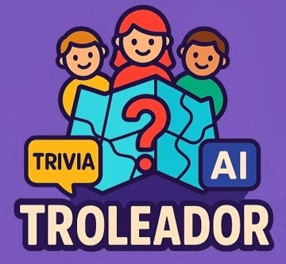
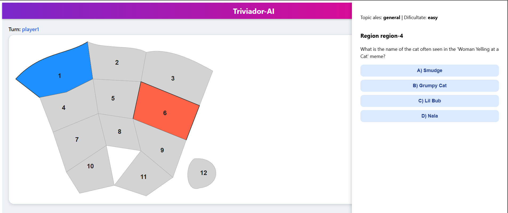

# Triviador-AI



---

### Demo

https://youtu.be/LnhngL4aRAI

## Description

**Triviador-AI** is a multiplayer trivia game set on a territory map where players compete to conquer regions by answering AI-generated questions. The game leverages the Google Gemini API to dynamically create trivia questions, delivering an engaging and educational gameplay experience.

---

---

## Key Features

- **Turn-based multiplayer** gameplay on a map with adjacent territories.  
- Initial territory selection and conquest through trivia questions.  
- Choice of question difficulty at game start (`easy`, `medium`, `hard`).  
- Temporarily increased question difficulty when conquering opponent's territories.  
- Opponent selects the topic for questions when attacking occupied territories.  
- Modern UI with clear highlighting of territories and game state.  
- Automatic detection of the winner when a player loses all territories.

---

## Technologies Used

- **Next.js** (React framework) for frontend and backend API.  
- **TypeScript** for type safety and scalable code.  
- **Google Gemini API** for dynamic trivia question generation.  
- **Tailwind CSS** for fast, responsive styling.  
- **React hooks** for state and effect management.

---

## Running Locally

1. Clone the repository:
```
  git clone https://github.com/username/triviador-ai.git
  cd triviador-ai
```

2. Install dependencies:
```
  npm install
```

3. Set your Google Gemini API key in a .env.local file:
```
  GEMINI_API_KEY=your_google_gemini_api_key
```

4. Start the development server:
```
  npm run dev
```

5. Open your browser and navigate to:
```
  http://localhost:3000/game
```

If you want to contribute or report issues, feel free to open a pull request or issue on GitHub.
